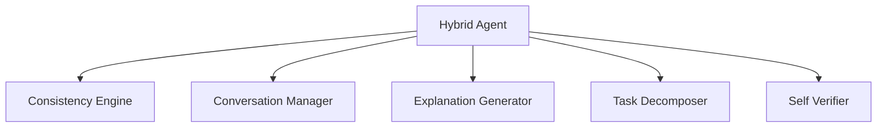

# Hybrid Agent Architecture

The hybrid agent architecture combines multiple reasoning components.

## Overview

Hybrid agent integrates consistency engine, conversation manager, explanation generator, and other components.

## Architecture

## Mathematical Foundation

Hybrid agent combines multiple reasoning modes:

$$R_{hybrid} = \alpha R_{LLM} + \beta R_{deterministic} + \gamma R_{symbolic}$$

Where $\alpha + \beta + \gamma = 1$ and each $R_i$ is a reasoning component.

## Components

- **[Consistency Engine](../features/hybrid-agent/consistency-engine.md)**: Ensures consistency
- **[Conversation Manager](../features/hybrid-agent/conversation-manager.md)**: Manages dialogue
- **[Task Decomposer](../features/hybrid-agent/task-decomposer.md)**: Decomposes tasks

## Next Steps

- [Components](components.md) - Component breakdown
- [Consistency](consistency.md) - Consistency mechanisms
