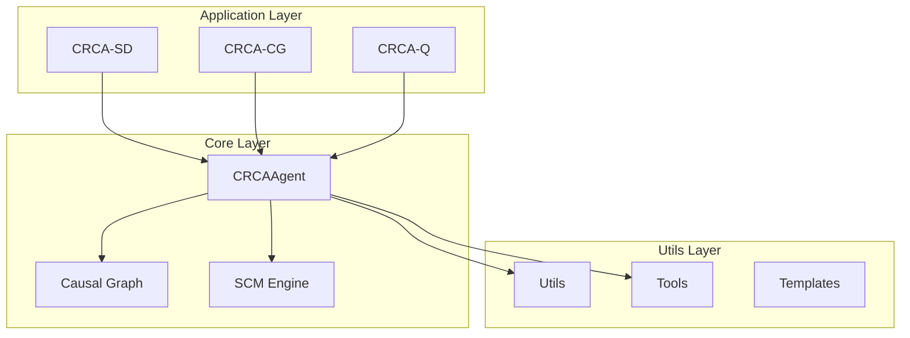

# Architecture Overview

CR-CA follows a modular architecture with clear separation of concerns.

## System Architecture

## Mathematical Foundation

The architecture implements a layered causal reasoning system:

**Layer 1 - Application**: Domain-specific agents
**Layer 2 - Core**: Causal reasoning engine with SCMs
**Layer 3 - Utils**: Supporting utilities and tools

The causal reasoning follows:

$$Y = f(Pa(Y), U_Y)$$

Where structural equations are defined at the core layer.

## Key Components

- **CRCAAgent**: Core causal reasoning agent
- **Causal Graph**: DAG representation of causal relationships
- **SCM Engine**: Structural causal model computation
- **Utils**: Supporting utilities
- **Templates**: Agent creation framework

## Documentation

- **[Design Principles](design-principles.md)**: Design principles
- **[Data Flow](data-flow.md)**: Data flow diagrams
- **[Modular Structure](modular-structure.md)**: Modular architecture
- **[Hybrid Agent](hybrid-agent/overview.md)**: Hybrid agent architecture
- **[Causal Graphs](causal-graphs.md)**: Causal graph architecture

## Next Steps

- [Design Principles](design-principles.md) - Design principles
- [Data Flow](data-flow.md) - Data flow
