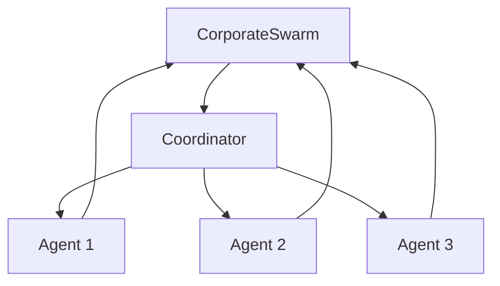

# CorporateSwarm

CorporateSwarm is a multi-agent system for corporate governance decision-making.

## Overview

CorporateSwarm coordinates multiple specialized agents to make complex corporate governance decisions.

## Architecture



## Usage

```python
from branches.crca_cg.corposwarm import CorporateSwarm

swarm = CorporateSwarm()
decision = swarm.make_decision(problem)
```

## Next Steps

- [ESG Scoring](esg-scoring.md) - ESG scoring system
