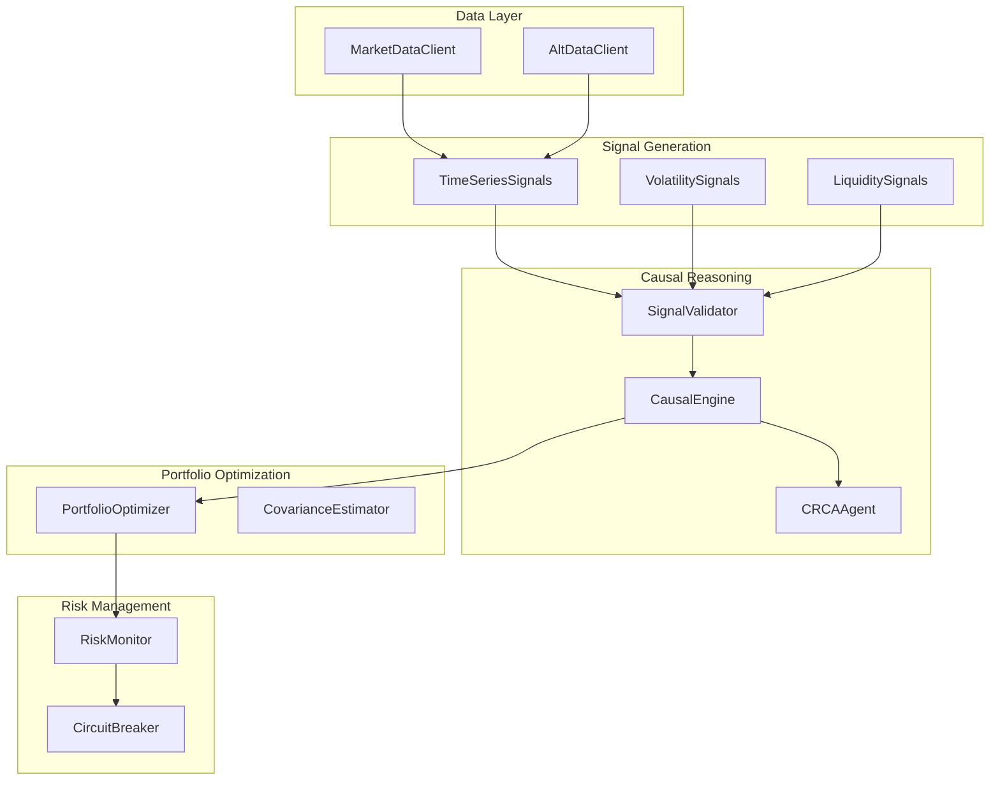

# CRCA-Q Architecture

CRCA-Q is organized into five major subsystems.

## System Architecture

## Data Flow

1. **Data Acquisition**: MarketDataClient and AltDataClient fetch data
2. **Signal Generation**: Multiple signal classes compute indicators
3. **Causal Validation**: CausalEngine validates signals using SCMs
4. **Prediction**: Ensemble models generate predictions
5. **Portfolio Optimization**: PortfolioOptimizer allocates capital
6. **Risk Management**: RiskMonitor and CircuitBreaker enforce limits
7. **Execution**: ExecutionEngine places trades

## Mathematical Foundation

The system implements a causal graph:

$$Sentiment \to Volume \to Liquidity \to Price Impact \to Returns$$

Each relationship is validated using:

$$P(Returns | do(Sentiment = s)) = \sum_{v,l} P(Returns | Sentiment=s, Volume=v, Liquidity=l) P(Volume=v, Liquidity=l | Sentiment=s)$$

## Next Steps

- [Market Data](market-data.md) - Market data client
- [Signal Generation](signal-generation.md) - Signal generation
